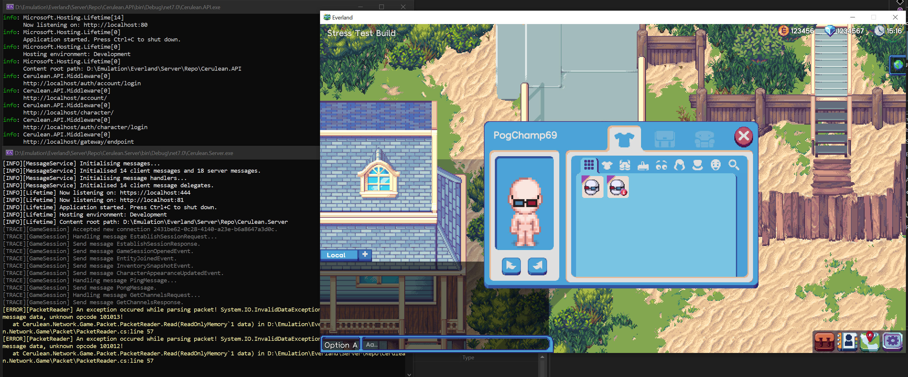

## Cerulean

### Information
A sandbox server emulator for the unreleased social MMO Everland that supports the Stress Test build.

*Fun Fact: The name Cerulean is based on the channel name present in Everland called Cerulean Creek.*

### Requirements
 * Visual Studio 2022 (.NET Core 7.0 and C# 11 support required).
 * MySQL Server (or equivalent, eg: MariaDB).
 * Everland Stress Test client.

### Screenshot
